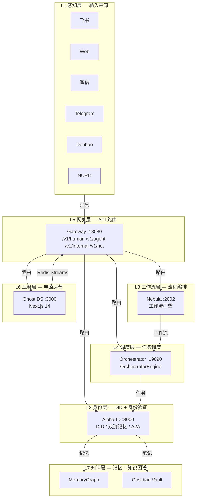

# Ghost Platform — 项目总览

> **版本**: 2.0 | **2026-08-04**  
> **原则**: 一个真相，一份文档，一个节奏。所有信息在此统一，不分散到多份文档。
> **工程铁律**: 死代码是用来盘活的，优化才是王道。不做简单归档，做全方面换血。

---

## 1. 项目定位

**Web4.0 AtoA（Agent-to-Anything）全域自主智能体操作系统**

三层堆栈：
- 理念层：Denny AI（人机共生的设计哲学）
- 系统中枢：Alpha-ID（DID 身份 + 双链记忆 + AgentLoop）
- 底层网络：Ghost AtoA（统一网关 + 事件总线 + 服务编排）

不做单点AI工具、不做工作流编排、不局限于技能市场。

---

## 2. 七层架构



### 架构说明

| 层级 | 核心服务 | 关键技术 | 职责 |
|:----:|:--------|:--------|:-----|
| L1 | 飞书 Bot / Web / 微信 / Telegram / Doubao / NURO | WebSocket, HTTP, CLI | 多渠道输入接入 |
| L2 | Alpha-ID (:8000) | FastAPI, TwinBrain, Dual-Chain Memory, A2A Protocol | DID 身份认证、智能体记忆、A2A 网络 |
| L3 | Nebula (:2002) | FastAPI, 7-layer middleware | 工作流引擎、飞书/微信消息解析 |
| L4 | Orchestrator (:19090) | OrchestratorEngine, ChannelAdapter, EventBus | 后台循环管理、渠道适配、任务调度 |
| L5 | Gateway (:18080) | FastAPI, 4 route groups | 统一 API 入口、路由分发、认证鉴权 |
| L6 | Ghost DS (:3000) | Next.js 14, Prisma, Redis Streams | 电商看板、订单/商品管理、Prometheus 监控 |
| L7 | MemoryGraph / Obsidian | Redis Streams, Obsidian API | 知识图谱、本地笔记、跨服务知识同步 |

### 服务间通信

```
┌─────────────┐     Redis Streams      ┌──────────────┐
│   Ghost DS   │ ◄────────────────────► │  Feishu      │
│   (:3000)    │   fulfillment:*       │  Consumer    │
└─────────────┘                        └──────────────┘
        │                                       │
        │ HTTP POST                             │ WebSocket
        ▼                                       ▼
┌─────────────┐     XREADGROUP      ┌──────────────┐
│  Gateway     │ ◄──────────────────► │  EventBus    │
│  (:18080)    │   alphaid:events:*   │  (Redis)     │
└──────┬──────┘                        └──────────────┘
       │
       ├──► /v1/human/chat ──► Alpha-ID (:8000)
       ├──► /v1/agent/chat ──► Alpha-ID (:8000)
       ├──► /v1/internal/* ──► Nebula (:2002)
       └──► /v1/net/* ──────► Net-Agent (:18180)
```

---

## 3. 服务清单

| 服务 | 端口 | 框架 | 职责 | 状态 |
|:-----|-----:|:-----|:-----|:-----|
| Gateway | 18080 | FastAPI | 统一 API 网关，四层路由 | ✅ 95% |
| Alpha-ID | 8000 | FastAPI | DID 身份、双链记忆、A2A | ✅ 95% |
| Nebula | 2002 | FastAPI | 工作流引擎、飞书/微信 webhook | ✅ 85% |
| Ghost DS | 3000 | Next.js 14 | 电商看板、订单/商品管理 | ✅ 90% |
| Orchestrator | 19090 | FastAPI | 任务调度（ToolA/ToolB） | ⚠️ 20% → 80%（Phase 1 后） |
| Feishu Bot | — | Python | 飞书 WebSocket + HTTP 双通道 | ✅ 80% |
| Feishu Consumer | — | Python | Redis Streams → 飞书通知 | ✅ 80% |
| Net-Agent | 18180 | FastAPI | 路由器管理 | ⚠️ 60% |
| Flow | 3036 | Fastify | 工作流前端门户 | ⚠️ 40% |
| Redis | 6379 | — | 缓存 + 事件总线 + 任务队列 | ✅ 95% |
| PostgreSQL | 5432 | — | 共享数据库 | ✅ 90% |
| Doubao Reader | — | Python | 豆包桌面日志解析（库，非服务） | ✅ 85% |
| NURO | — | Python | 桌面宠物，本地 AI | ⚠️ 30% |

---

## 4. 术语表（TERM 规则）

| 标准术语 | 是什么 | 禁止别名 | 文件参考 |
|:---------|:-------|:---------|:---------|
| `OrchestratorEngine` | 统一后台循环管理 | MasterOrchestrator | `orchestrator/engine.py` |
| `EventBus` | Redis Streams 跨服务事件总线 | blinker | `core/event_bus.py` |
| `AgentGraph` | A2A 网络拓扑（运行时计算） | agent_graph | `a2a.py:447` |
| `MemoryGraph` | 记忆知识图谱（按标签关联） | memory graph | `memory_graph.py` |
| `TwinBrain` | 智能体大脑（唯一实例） | brain | `core/twin_brain.py` |
| `ChannelAdapter` | 渠道适配器基类 | adapter | `core/orchestrator.py` |
| `GhostDS` | Next.js 电商看板（端口 3000） | DS | `DS/` |
| `Gateway` | 统一 API 网关（端口 18080） | 网关 | `ghost-main/gateway/` |

**代码注释规范**：在关键类/函数定义处加 `# TERM:` 注释。
```python
# TERM: EventBus — Redis Streams 跨服务事件总线（替代旧 blinker 实现）
class EventBus:
    ...
```

---

## 5. 三条主线

### 豆包知识输入线
```
Doubao Reader（桌面日志解析）
  → Gateway /v1/internal/doubao/capture
  → Alpha-ID dual-chain/save（记忆存储）
  → Obsidian vault（本地笔记）
```

### 飞书助理线
```
飞书 WebSocket/Webhook
  → Nebula /api/v1/wechat（消息解析）
  → Gateway /v1/human/chat（统一入口）
  → Alpha-ID /api/v1/agent/chat（TwinBrain + AgentLoop）
  → 飞书回复
```

### Ghost DS 电商线
```
OneBound/Shoplazza（货源/店铺）
  → DS 前端（订单/商品管理）
  → Redis Streams（事件发布）
  → Feishu Consumer（飞书通知）
```

---

## 6. 已知问题

### P0 — 必须修复
- [x] 飞书 webhook → `/v1/chat` 断裂（已修复：Gateway 加别名路由）
- [x] Redis Streams 消费休眠（已修复：eventbus-init.ts 加 startConsuming）
- [x] 两个 MasterOrchestrator 同名冲突（已修复：合并为 OrchestratorEngine）
- [x] EventBus blinker 与 TS Redis Streams 不互通（已修复：Python 改用 Redis Streams）
- [x] eventbus-server.ts 重复（已修复：合并到 eventbus-init.ts）

### P1 — 应该修复
- [x] wechat.py 未接入 Gateway（已修复：加 /v1/internal/webhook/wechat 路由）
- [ ] Ghost DS CI 加入 GitHub Actions（部分完成：加了 job，需验证跑通）
- [ ] Orchestrator 功能评分 20% → 80%（ToolA/ToolB 已接入 HTTP，需真实服务）

### P2 — 后续优化
- [ ] ToolA/ToolB 接入真实服务（当前为 stub）
- [ ] Flow 工作流前端 (:3036) 接入 Gateway
- [ ] NURO 桌面宠物功能完善
- [ ] Net-Agent 功能完善（60% → 90%）
- [ ] 术语注释标准化（已开始：# TERM: 注释）

---

## 7. 工程规范

### 7.1 代码提交规范

```
<type>(<scope>): <description>
```

- **type**: `feat` / `fix` / `refactor` / `perf` / `docs` / `chore` / `test`
- **scope**: `orchestrator` / `eventbus` / `gateway` / `alphaid` / `nebula` / `ds` / `feishu` / `infra`
- **description**: 中文或英文，必须说明改了什么、为什么改
- **body**（可选）：详细说明变更动机、 Breaking changes
- **footer**（可选）：关联 Issue `Closes #123`

**示例**：
```
feat(eventbus): 将 EventBus 底层从 blinker 迁移到 Redis Streams
- 保持 emit/on/get_event_bus 接口不变
- 新增 start_consuming() 方法激活跨服务消费
- 解决 Python 与 TS 事件总线不互通的问题

Closes #42
```

### 7.2 代码审查规范

**所有代码必须经过 CR 才能合入主分支：**

1. **自检清单**（提交前必须逐项确认）：
   - [ ] 语法检查通过（Python: `ast.parse` / TS: `tsc --noEmit`）
   - [ ] 单元测试通过（如有）
   - [ ] 无 Console.log / print 遗留调试代码
   - [ ] 关键类/函数加 `# TERM:` 注释
   - [ ] 无硬编码密钥/密码
   - [ ] 错误处理完整（try/except + 日志）

2. **CR 检查点**：
   - 架构一致性：是否符合七层架构设计
   - 接口兼容性：是否破坏现有 API
   - 性能影响：是否有 N+1 查询、内存泄漏风险
   - 安全风险：是否有注入、越权、信息泄露

### 7.3 命名规范

| 类型 | 规范 | 示例 |
|:-----|:-----|:-----|
| Python 类 | `PascalCase` | `OrchestratorEngine`, `ChannelAdapter` |
| Python 函数/变量 | `snake_case` | `get_event_bus`, `start_consuming` |
| Python 常量 | `UPPER_SNAKE_CASE` | `STREAM_PREFIX`, `MAX_HISTORY` |
| TypeScript 接口 | `PascalCase` | `FulfillmentItem`, `EventBusConfig` |
| TypeScript 变量/函数 | `camelCase` | `createFulfillmentOrder`, `startConsuming` |
| 文件 | `kebab-case` | `event-bus.ts`, `orchestrator-engine.py` |
| 目录 | `snake_case` | `core/`, `gateway/`, `mindflow_map/` |

### 7.4 术语规范（TERM 规则）

**禁止在代码中使用模糊别名。每个核心概念有且只有一个标准术语。**

| 标准术语 | 是什么 | 禁止别名 | 文件参考 |
|:---------|:-------|:---------|:---------|
| `OrchestratorEngine` | 统一后台循环管理 | MasterOrchestrator | `orchestrator/engine.py` |
| `EventBus` | Redis Streams 跨服务事件总线 | blinker | `core/event_bus.py` |
| `AgentGraph` | A2A 网络拓扑（运行时计算） | agent_graph | `a2a.py:447` |
| `MemoryGraph` | 记忆知识图谱（按标签关联） | memory graph | `memory_graph.py` |
| `TwinBrain` | 智能体大脑（唯一实例） | brain | `core/twin_brain.py` |
| `ChannelAdapter` | 渠道适配器基类 | adapter | `core/orchestrator.py` |
| `GhostDS` | Next.js 电商看板（端口 3000） | DS | `DS/` |
| `Gateway` | 统一 API 网关（端口 18080） | 网关 | `ghost-main/gateway/` |

**代码注释规范**：在关键类/函数定义处加 `# TERM:` 注释。
```python
# TERM: EventBus — Redis Streams 跨服务事件总线（替代旧 blinker 实现）
class EventBus:
    ...
```

### 7.5 死代码处理规范

**死代码是用来盘活的，不是用来删的。**

处理流程：
1. **发现**：通过 `git grep` / IDE 搜索确认无引用
2. **评估**：是否属于活跃业务链路？是否有潜在价值？
3. **盘活**：如果有价值，接入活跃链路，写测试
4. **归档**：如果确认无价值，移到 `docs/archived/` 目录
5. **删除**：仅在确认彻底无价值后删除，需在 commit message 说明原因

### 7.6 测试规范

| 测试类型 | 工具 | 触发时机 | 覆盖率要求 |
|:--------|:-----|:---------|:----------|
| 单元测试 | pytest / Jest | 每次 commit | 核心模块 ≥ 80% |
| 集成测试 | pytest + httpx | PR 合入前 | 关键路径 100% |
| E2E 测试 | Docker Compose | 每日 CI | 全链路可用性 |
| 类型检查 | mypy / tsc | 每次 commit | 零错误 |

### 7.7 CI/CD 规范

**GitHub Actions 自动运行：**

- **Python 服务**（Alpha-ID, Nebula, Orchestrator）：
  - `ruff check` — 代码规范
  - `mypy` — 类型检查
  - `pytest` — 单元测试
  - `docker compose config` — 配置验证

- **Node.js 服务**（Ghost DS）：
  - `eslint` — 代码规范
  - `tsc --noEmit` — 类型检查
  - `next build` — 构建验证

- **E2E 验证**：
  - `docker compose up` — 全栈启动
  - 健康检查：所有服务 `healthy`
  - API 冒烟测试：`/v1/health` 全绿

---

## 8. 每周节奏

每周做三件事：

1. **看状态**：`make ps` 有 unhealthy 吗？CI 全绿了吗？
2. **进一个问题**：从第 6 节挑一个 P0/P1 做掉
3. **关一个问题**：做完的划掉，更新本节

**持续 4 周，项目从"一盘散沙"变成"有脉搏的系统"。**

---

## 9. 变更日志

| 版本 | 日期 | 变更 |
|:-----|:-----|:-----|
| 2.0 | 2026-08-04 | 重构文档结构，新增工程规范（7.1-7.7），新增架构图（Mermaid），新增服务间通信图 |
| 1.0 | 2026-08-04 | 初始版本，合并 8 份管理文档为 1 份 |

---

*本文件是 Ghost Platform 的唯一真相源。所有其他文档已合并到此。*
