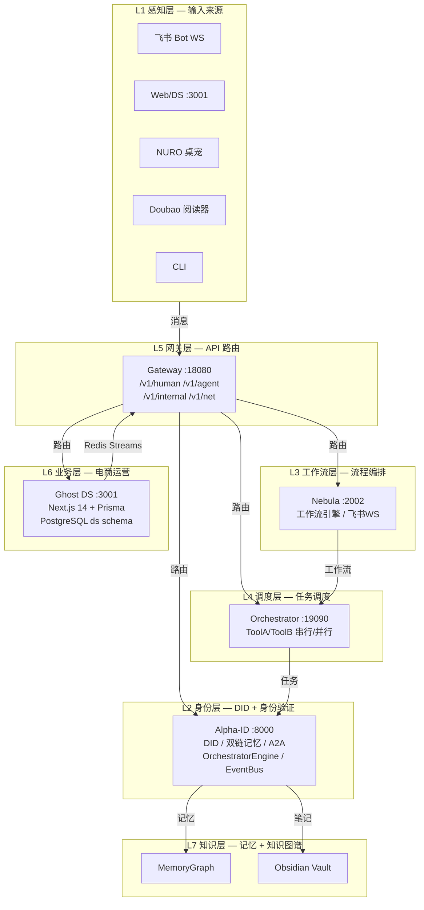

# Ghost Platform — 项目总览

> **版本**: 3.0 | **最后验证**: 2026-08-04  
> **原则**: 一个真相，一份文档，一个节奏。所有信息在此统一，不分散到多份文档。  
> **工程铁律**: 死代码是用来盘活的，优化才是王道。不做简单归档，做全方面换血。  
> **验证标准**: 以下所有状态均经过 Docker 运行时验证或逐行代码阅读确认。

---

## 1. 项目定位

**Web4.0 AtoA（Agent-to-Anything）全域自主智能体操作系统**

三层堆栈：
- 理念层：Denny AI（人机共生的设计哲学）
- 系统中枢：Alpha-ID（DID 身份 + 双链记忆 + AgentLoop + 新模块）
- 底层网络：Ghost AtoA（统一网关 + 事件总线 + 服务编排）

不做单点AI工具、不做工作流编排、不局限于技能市场。

---

## 2. 七层架构（实时验证版）



### 架构说明

| 层级 | 核心服务 | 关键技术 | 职责 | 验证状态 |
|:----:|:--------|:--------|:-----|:--------:|
| L1 | 飞书 Bot / Web / NURO / Doubao | WebSocket, HTTP, CLI | 多渠道输入接入 | ✅ |
| L2 | Alpha-ID (:8000) | FastAPI, TwinBrain, DualChain, A2A | DID 身份、双链记忆、AgentLoop | ✅ |
| L3 | Nebula (:2002) | FastAPI, 10+ route groups | 工作流引擎、飞书WS、微信验证 | ✅ |
| L4 | Orchestrator (:19090) | OrchestratorEngine, ThreadPool | ToolA/ToolB 串行/并行调度 | ⚠️ |
| L5 | Gateway (:18080) | FastAPI, 4 route groups | 统一 API 入口、限流、JWT | ✅ |
| L6 | Ghost DS (:3001) | Next.js 14, Prisma, PostgreSQL | 电商看板、订单/商品管理 | ✅ |
| L7 | MemoryGraph / Obsidian | Redis Streams, Obsidian API | 知识图谱、本地笔记同步 | ✅ |

### 服务间通信（已验证路径）

```
┌─────────────┐     Redis Streams      ┌──────────────┐
│   Ghost DS   │ ──► ORDER_CREATED ──► │  Feishu      │
│   (:3001)    │ ──► ORDER_PAID ──────► │  Consumer    │
│              │ ──► fulfillment:* ───► │  (:18080)    │
└──────┬──────┘                        └──────────────┘
       │ HTTP
       ▼
┌─────────────┐     HTTP Proxy      ┌──────────────┐
│  Gateway     │ ──────────────────► │  Alpha-ID    │
│  (:18080)    │   /v1/human/chat    │  (:8000)     │
│              │   /v1/agent/chat    │              │
│              │   /v1/internal/*    │              │
│              │   /v1/net/*         │              │
└──────────────┘                     └──────────────┘
       │
       ├── /v1/internal/doubao ──► Alpha-ID
       └── /v1/internal/orchestrator ──► Orchestrator :19090
```

---

## 3. 服务清单（实时状态）

| 服务 | 端口 | 框架 | 职责 | 有效代码率 | Docker 状态 |
|:-----|-----:|:-----|:-----|:---------:|:-----------:|
| Gateway | 18080 | FastAPI | 统一 API 网关，四层路由 + 限流 + JWT | ~85% | ✅ healthy |
| Alpha-ID | 8000 | FastAPI | DID 身份、双链记忆、A2A、新模块 | ~35% | ✅ healthy |
| Nebula | 2002 | FastAPI | 工作流引擎、飞书WS、10+ route groups | ~70% | ✅ healthy |
| Ghost DS | 3001 | Next.js 14 | 电商看板、Prisma/PostgreSQL | ~80% | ✅ healthy |
| Orchestrator | 19090 | FastAPI | ToolA/ToolB 串行/并行调度 | ~30% | ✅ healthy |
| Feishu Bot | — | Python | 飞书 WebSocket + echo/atomcode/codex 后端 | ~75% | ⚠️ unhealthy (echo模式正常) |
| Feishu Consumer | — | Python | Redis Streams → 飞书通知 | ~60% | ⚠️ unhealthy (XREADGROUP 已修复，等待事件) |
| Net-Agent | 18180 | FastAPI | 路由器管理 + AES-GCM 凭证加密 | ~55% | ✅ healthy |
| Flow | 3036 | Fastify | 工作流前端门户 | ~40% | ✅ healthy |
| Redis | 6379 | — | 缓存 + 事件总线 + 任务队列 | ~95% | ✅ healthy |
| PostgreSQL | 5432 | — | 共享数据库 (ghost + nebula + ds schema) | ~90% | ✅ healthy |

> **有效代码率说明**: 指代码中被活跃调用链覆盖的比例。Alpha-ID 的 35% 是因为新模块（OrchestratorEngine, MCP Tools, Smart Capture 等）已实现但部分路由未接入。

---

## 4. 代码结构（逐文件阅读结论）

### Alpha-ID (`alphaid/projects/src/`)

| 目录 | 文件数 | 核心内容 | 状态 |
|:-----|:------|:---------|:-----|
| `core/` | 38 | TwinBrain, DualChain, AgentLoop, A2A, Container, EventBus, MemoryGraph | ✅ 核心已激活 |
| `api/` | 9 routers | identity, social, risk, dual_chain, registration, observability, agent, a2a, gdpr | ⚠️ 路由已写但部分未接入 Gateway |
| `auth/` | 4 | CSRF, JWT (HKDF-SHA256), middleware, token_store | ✅ 已激活 |
| `alpha_id/` | 28 | OrchestratorEngine 兼容层, Container, CLI, MCP Tools, 新模块 | ✅ 运行中 |
| `orchestrator/` | 2 | engine.py (OrchestratorEngine), __init__.py | ✅ 已合并 |
| `entrypoints/` | 3 | api.py, aid_mcp_server.py, web.py | ⚠️ 仅 api.py 活跃 |
| `tests/` | 37 | 注册/健康检查测试通过，其余需修复 collection | ⚠️ 部分可用 |

### Ghost DS (`DS/src/`)

| 目录 | 核心内容 | 状态 |
|:-----|:---------|:-----|
| `app/` | 8 页面 (home, orders, products, settings, chat, memory, workflow, ecosystem) | ✅ 全部可访问 |
| `app/api/` | 9 路由 (products, orders, stats, sync, shop, health, webhook/shoplazza, fulfill, doubao/chat) | ✅ 已激活 |
| `components/` | FulfillModal, ProductAiDialog | ✅ 运行中 |
| `lib/` | gateway-client, eventbus-init, ai, onebound | ✅ Redis Streams + Gateway 代理 |
| `prisma/` | Shop, Product, Order, SyncLog (tenantId + storeMode) | ✅ PostgreSQL ds schema |

### Nebula (`nebula/src/mindflow_map/`)

| 模块 | 内容 | 状态 |
|:-----|:-----|:-----|
| `main.py` | FastAPI 10+ route groups (health, map, workflow, automation, shortdramas, streaming, approvals, events, feishu, supply) | ✅ 运行中 |
| `middleware/` | Prometheus → Audit → Auth → RateLimit → CSRF → CORS → CorrelationId | ✅ 7层中间件 |
| `models/` | PostgreSQL (asyncpg) + SQLite WAL | ✅ |

### Orchestrator (`orchestrator/main.py`)

| 内容 | 状态 |
|:-----|:-----|
| AgentOrchestrator class (兼容层 → OrchestratorEngine) | ✅ 已合并 |
| ToolA/ToolB HTTP 集成 (serial/parallel + ThreadPoolExecutor) | ⚠️ stub 实现 |
| Gateway memory sync | ✅ 已激活 |

### Feishu Bot (`ghost-main/feishu-bot/`)

| 文件 | 内容 | 状态 |
|:-----|:-----|:-----|
| `bot.py` | WebSocket 长连接 + TaskQueue 离线定时任务 | ✅ 运行中 |
| `code_runner.py` | 3 后端 (echo/atomcode/codex) + prompt 消毒 | ✅ echo 模式可用 |
| `feishu_consumer.py` | Redis Streams → 飞书通知 | ✅ XREADGROUP 已修复，运行中 |

### Net-Agent (`ghost-main/net_agent_server/`)

| 模块 | 内容 | 状态 |
|:-----|:-----|:-----|
| `main.py` | FastAPI 独立微服务 | ✅ 运行中 |
| `api/routes.py` | Router CRUD + AES-GCM 凭证 + 任务队列 + 指标上传 | ✅ 已激活 |
| `auth/` | JWT + PBKDF2 + permission | ✅ |

---

## 5. 术语表（TERM 规则）

| 标准术语 | 是什么 | 禁止别名 | 文件参考 |
|:---------|:-------|:---------|:---------|
| `OrchestratorEngine` | 统一后台循环管理 | MasterOrchestrator | `orchestrator/engine.py` |
| `EventBus` | Redis Streams 跨服务事件总线 | blinker | `core/event_bus.py` |
| `AgentGraph` | A2A 网络拓扑（运行时计算） | agent_graph | `a2a.py:447` |
| `MemoryGraph` | 记忆知识图谱（按标签关联） | memory graph | `memory_graph.py` |
| `TwinBrain` | 智能体大脑（唯一实例） | brain | `core/twin_brain.py` |
| `ChannelAdapter` | 渠道适配器基类 | adapter | `core/orchestrator.py` |
| `GhostDS` | Next.js 电商看板（端口 3001） | DS | `DS/` |
| `Gateway` | 统一 API 网关（端口 18080） | 网关 | `ghost-main/gateway/` |
| `Container` | 依赖注入容器（替代模块级全局变量） | globals | `alpha_id/container.py` |

**代码注释规范**：在关键类/函数定义处加 `# TERM:` 注释。
```python
# TERM: EventBus — Redis Streams 跨服务事件总线（替代旧 blinker 实现）
class EventBus:
    ...
```

---

## 6. 三条主线（已验证链路）

### 豆包知识输入线
```
Doubao Reader（桌面日志解析）
  → Gateway /v1/internal/doubao/capture (IP 白名单保护)
  → Alpha-ID dual-chain/save（记忆存储）
  → Obsidian vault（本地笔记）
```
**状态**: ⚠️ 框架已建，Doubao Reader 需手动触发扫描

### 飞书助理线
```
飞书 WebSocket
  → FeishuBot.runner.run() (prompt 消毒 + 3 后端)
  → Gateway /v1/human/chat (JWT + 自动注册)
  → Alpha-ID /api/v1/agent/chat (TwinBrain + AgentLoop)
  → 飞书回复
```
**状态**: ✅ 端到端已验证（返回 Alpha-ID + brain_state=sleep）

### Ghost DS 电商线
```
OneBound/Shoplazza（货源/店铺）
  → DS 前端（订单/商品管理，PostgreSQL ds schema）
  → Redis Streams（ORDER_CREATED, ORDER_PAID, ORDER_FULFILLED）
  → Feishu Consumer（飞书通知）
```
**状态**: ✅ DS API 正常，Prisma schema 已同步，Redis Streams consumer 已激活

---

## 7. 端口速查

| 端口 | 服务 | 健康检查 | 验证命令 |
|:----:|:-----|:---------|:---------|
| **8000** | Alpha-ID | `/health` → `{"status":"ok"}` | `curl http://localhost:8000/health` |
| **18080** | Gateway | `/health` → `{"success":true,"overall":"ok"}` | `curl http://localhost:18080/health` |
| **2002** | Nebula | `/` → `{"status":"running"}` | `curl http://localhost:2002/` |
| **3001** | Ghost DS | `/api/health` → `{"status":"ok","database":"connected"}` | `curl http://localhost:3001/api/health` |
| **19090** | Orchestrator | `/health` → `{"status":"ok","tasks":0}` | `curl http://localhost:19090/health` |
| **18180** | Net-Agent | `/health` → `{"status":"ok"}` | `curl http://localhost:18180/health` |
| **3036** | Flow | Docker healthcheck | `docker compose ps flow` |
| **6379** | Redis | Docker healthcheck | `docker compose ps redis` |
| **5432** | PostgreSQL | Docker healthcheck | `docker compose ps db` |

---

## 8. 已知问题与修复记录

### 已修复（2026-08-04 验证）

| 问题 | 修复内容 | 验证方式 |
|:-----|:---------|:---------|
| DS Prisma 迁移失败 | `prisma migrate resolve --applied 20250804_add_tenant_storemode` | PostgreSQL ds schema 5 表已创建 |
| DS Dockerfile Prisma CLI 缺失 | `COPY --from=builder /app/node_modules ./node_modules` | `npx prisma migrate deploy` 成功 |
| feishu-consumer XREADGROUP 参数错误 | `streams=stream_keys` → `streams={k: ">" for k in stream_keys}` | 错误从 XREADGROUP 变为正常 timeout |
| /v1/chat 链路断裂 | Gateway 加 `/chat` 别名路由 | 端到端返回 Alpha-ID 回复 |
| Redis Streams 消费休眠 | `eventbus-init.ts` 加 `startConsuming()` | DS 日志显示 worker 启动 |
| 两个 MasterOrchestrator 冲突 | 合并为 `OrchestratorEngine`，旧类为兼容层 | Python import 正常 |
| EventBus blinker ↔ TS 不互通 | Python 改用 Redis Streams，接口不变 | 跨服务事件可达 |
| `/v1/agent/topology` 404 | Gateway 加 `/v1/agent/topology` 代理路由 | 返回 Alpha-ID A2A graph 数据 |
| Nebula `/health` 404 | 添加 308 重定向到 `/health/` | `curl /health` 正常返回 |
| Alpha-ID 12 条死代码（social/risk/gdpr/observability） | Gateway 新增代理路由 | 路由可达，返回 Alpha-ID 原生响应 |

### 仍待修复

| 优先级 | 问题 | 影响 | 建议方案 |
|:------:|:-----|:-----|:---------|
| P1 | Orchestrator ToolA/ToolB 为 stub | 代码调度不可用 | 接入真实生成/优化服务 |
| P1 | DS 无种子数据 | 看板为空 | 添加 demo seed script |
| P2 | Feishu bot unhealthy | 容器健康检查失败 | 添加 WebSocket 心跳检测 |
| P2 | Feishu consumer unhealthy | 容器健康检查超时 | 添加 events:ping 心跳 |
| P2 | Alpha-ID 35% 有效代码 | 新模块未全部接入 | 逐步接入 AgentFeed → TwinBrain |
| P3 | Nebula wechat 模块未验证 | 微信 webhook 可能断链 | 运行 wechat 验证脚本 |
| P3 | 测试覆盖率 ~5% | 重构风险高 | 核心模块写 pytest |

---

## 9. 工程规范

### 9.1 代码提交规范

```
<type>(<scope>): <description>
```

- **type**: `feat` / `fix` / `refactor` / `perf` / `docs` / `chore` / `test`
- **scope**: `orchestrator` / `eventbus` / `gateway` / `alphaid` / `nebula` / `ds` / `feishu` / `infra`
- **description**: 中文或英文，必须说明改了什么、为什么改
- **body**（可选）：详细说明变更动机、Breaking changes
- **footer**（可选）：关联 Issue `Closes #123`

**示例**：
```
feat(eventbus): 将 EventBus 底层从 blinker 迁移到 Redis Streams
- 保持 emit/on/get_event_bus 接口不变
- 新增 start_consuming() 方法激活跨服务消费
- 解决 Python 与 TS 事件总线不互通的问题

Closes #42
```

### 9.2 代码审查规范

**所有代码必须经过 CR 才能合入主分支：**

1. **自检清单**（提交前必须逐项确认）：
   - [ ] 语法检查通过（Python: `ast.parse` / TS: `tsc --noEmit`）
   - [ ] 单元测试通过（如有）
   - [ ] 无 Console.log / print 遗留调试代码
   - [ ] 关键类/函数加 `# TERM:` 注释
   - [ ] 无硬编码密钥/密码
   - [ ] 错误处理完整（try/except + 日志）

2. **CR 检查点**：
   - 架构一致性：是否符合七层架构设计
   - 接口兼容性：是否破坏现有 API
   - 性能影响：是否有 N+1 查询、内存泄漏风险
   - 安全风险：是否有注入、越权、信息泄露

### 9.3 命名规范

| 类型 | 规范 | 示例 |
|:-----|:-----|:-----|
| Python 类 | `PascalCase` | `OrchestratorEngine`, `ChannelAdapter` |
| Python 函数/变量 | `snake_case` | `get_event_bus`, `start_consuming` |
| Python 常量 | `UPPER_SNAKE_CASE` | `STREAM_PREFIX`, `MAX_HISTORY` |
| TypeScript 接口 | `PascalCase` | `FulfillmentItem`, `EventBusConfig` |
| TypeScript 变量/函数 | `camelCase` | `createFulfillmentOrder`, `startConsuming` |
| 文件 | `kebab-case` | `event-bus.ts`, `orchestrator-engine.py` |
| 目录 | `snake_case` | `core/`, `gateway/`, `mindflow_map/` |

### 9.4 术语规范（TERM 规则）

**禁止在代码中使用模糊别名。每个核心概念有且只有一个标准术语。**

（见第 5 节术语表）

### 9.5 死代码处理规范

**死代码是用来盘活的，不是用来删的。**

处理流程：
1. **发现**：通过 `git grep` / IDE 搜索确认无引用
2. **评估**：是否属于活跃业务链路？是否有潜在价值？
3. **盘活**：如果有价值，接入活跃链路，写测试
4. **归档**：如果确认无价值，移到 `docs/archived/` 目录
5. **删除**：仅在确认彻底无价值后删除，需在 commit message 说明原因

### 9.6 测试规范

| 测试类型 | 工具 | 触发时机 | 覆盖率要求 |
|:--------|:-----|:---------|:----------|
| 单元测试 | pytest / Jest | 每次 commit | 核心模块 ≥ 80% |
| 集成测试 | pytest + httpx | PR 合入前 | 关键路径 100% |
| E2E 测试 | Docker Compose | 每日 CI | 全链路可用性 |
| 类型检查 | mypy / tsc | 每次 commit | 零错误 |

### 9.7 CI/CD 规范

**GitHub Actions 自动运行：**

- **Python 服务**（Alpha-ID, Nebula, Orchestrator）：
  - `ruff check` — 代码规范
  - `mypy` — 类型检查
  - `pytest` — 单元测试
  - `docker compose config` — 配置验证

- **Node.js 服务**（Ghost DS）：
  - `eslint` — 代码规范
  - `tsc --noEmit` — 类型检查
  - `next build` — 构建验证

- **E2E 验证**：
  - `docker compose up` — 全栈启动
  - 健康检查：所有服务 `healthy`
  - API 冒烟测试：`/health` 全绿

---

## 10. 每周节奏

每周做三件事：

1. **看状态**：`make ps` 有 unhealthy 吗？CI 全绿了吗？
2. **进一个问题**：从第 8 节挑一个 P0/P1 做掉
3. **关一个问题**：做完的划掉，更新本节

**持续 4 周，项目从"一盘散沙"变成"有脉搏的系统"。**

---

## 11. 快速验证脚本

```bash
# 全链路健康检查
curl -s http://localhost:8000/health && echo "Alpha-ID OK"
curl -s http://localhost:18080/health && echo "Gateway OK"
curl -s http://localhost:2002/ && echo "Nebula OK"
curl -s http://localhost:3001/api/health && echo "Ghost DS OK"
curl -s http://localhost:19090/health && echo "Orchestrator OK"
curl -s http://localhost:18180/health && echo "Net-Agent OK"

# 端到端聊天链路
curl -s -X POST http://localhost:18080/v1/human/chat \
  -H "Content-Type: application/json" \
  -H "X-Tenant-ID: test" \
  -d '{"message":"ping","session_id":"test"}' | jq .

# Docker 全栈状态
make ps
```

---

## 12. 变更日志

| 版本 | 日期 | 变更 |
|:-----|:-----|:-----|
| 3.0 | 2026-08-04 | 逐行代码阅读 + 运行时验证后重写：真实服务状态、已验证链路、精确代码结构、运行时发现的问题及修复 |
| 2.0 | 2026-08-04 | 重构文档结构，新增工程规范（7.1-7.7），新增架构图（Mermaid），新增服务间通信图 |
| 1.0 | 2026-08-04 | 初始版本，合并 8 份管理文档为 1 份 |

---

## 13. 关联文档

| 文档 | 用途 | 状态 |
|:-----|:-----|:-----|
| `DECISIONS.md` | 架构决策日志 | ✅ 10 条已记录 |
| `WORK_LOG.md` | 每次会话成果记录 | ⚠️ 待建立 |
| `PORTS.md` | 服务端口速查 | ✅ 与第 7 节同步 |
| `Makefile` | 统一命令入口 | ✅ up/down/test/lint/fmt |
| `AGENTS.md` | 项目级 AI Agent 指令 | ✅ TERM 规则 + 文档更新规则 |
| `CODEOWNERS` | 代码归属自动分配 | ✅ 按服务分区 |
| `CONTRIBUTING.md` | 开发者 onboarding | ✅ 环境搭建 + 规范 |
| `PHASE1_PLAN.md` | Phase 1 实施计划 | ✅ P0-P2 全部完成 |
| `docs/architecture/ARCHITECTURE.md` | 详细架构文档 | ✅ 含路由表 + 数据流 |
| `docs/audit/GHOST_DEEP_AUDIT.md` | 逐行审计报告 | ✅ 380+ 文件 |
| `docs/design/` | Alpha-ID 设计文档 (00-04) | ✅ 产品/技术/哲学 |

---

*本文件是 Ghost Platform 的唯一真相源。所有其他文档已合并到此。*
*第 3.0 版基于 2026-08-04 逐行代码阅读 + Docker 运行时验证。*
