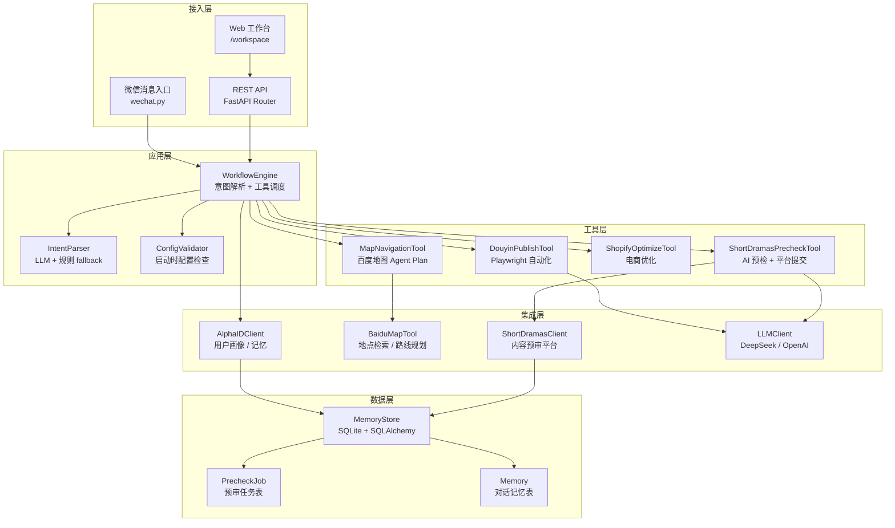
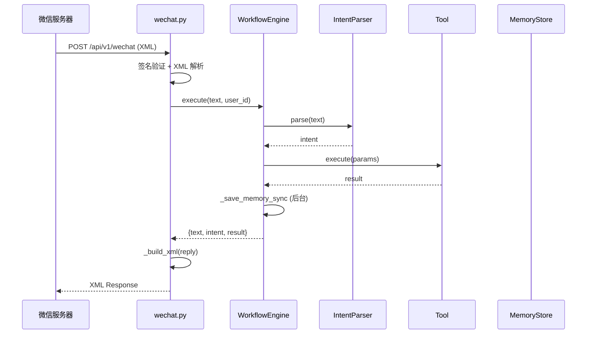
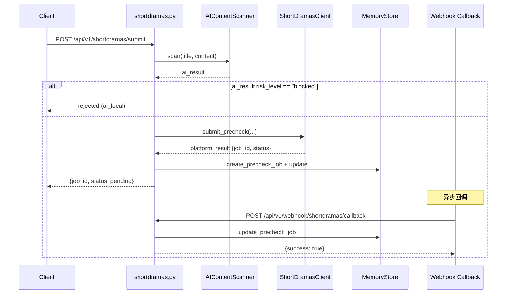

# MindFlow Map 架构文档

> MindFlow Map 是一个 AI 驱动的智能助理后端服务，集成了地图导航、短视频内容预审、微信消息入口和电商优化能力。

---

## 1. 总体架构

---

## 2. 模块职责

### 2.1 接入层

| 模块 | 职责 |
|------|------|
| `api/wechat.py` | 微信服务器验证、消息接收与回复 XML 构造 |
| `api/map.py` | 地图查询 REST 端点 |
| `api/workflow.py` | 工作流执行 REST 端点 |
| `api/shortdramas.py` | 短剧预审提交 / 查询 / 任务列表 / 回调接收 |
| `api/automation.py` | 抖音发布、Shopify 商品管理 |

### 2.2 应用层

| 模块 | 职责 |
|------|------|
| `workflows/engine.py` | 核心调度器：意图解析 → 工具选择 → 执行 → 记忆保存 |
| `ai/intent.py` | LLM 意图分类，失败时 fallback 到规则引擎 |
| `ai/fallback_rules.py` | 纯函数规则引擎，零外部依赖 |
| `config_validator.py` | 启动时检查各平台配置完整性 |

### 2.3 工具层

| 模块 | 职责 |
|------|------|
| `tools/baidu_map.py` | 百度地图 Agent Plan API 封装 |
| `automation/douyin.py` | Playwright 驱动抖音创作者中心自动化 |
| `automation/shopify.py` | Shopify 商品管理（待实现） |
| `integration/shortdramas.py` | 短剧平台内容预审 API 客户端 |

### 2.4 数据层

| 模块 | 职责 |
|------|------|
| `memory/store.py` | SQLite + SQLAlchemy 异步会话管理 |
| `memory/store.py:PrecheckJob` | 预审任务持久化模型 |
| `memory/store.py:Memory` | 用户对话记忆模型 |

---

## 3. 数据流

### 3.1 微信消息处理流

### 3.2 短剧预审流程

---

## 4. 关键设计决策

### 4.1 为什么 WorkflowEngine 单例共享？

微信入口、REST API、工作流 API 都需要访问同一个意图解析器和工具集。通过 `app.state.workflow_engine` 注入，避免：
- 重复创建 `ThreadPoolExecutor`（资源泄漏）
- 重复初始化 `AlphaIDClient`（连接池浪费）
- 工具实例状态不一致

### 4.2 为什么 IntentParser 需要 fallback？

LLM 调用依赖外部 API，可能因网络、配额、配置缺失失败。fallback 规则引擎保证：
- 离线可用
- 启动无阻塞
- 关键意图（导航、搜索、发布）始终可识别

### 4.3 为什么 MemoryStore 不用 ORM session 注入？

当前设计每次调用创建独立 `MemoryStore` 实例，但共享底层 SQLite 文件。`init()` 懒调用确保表结构在首次访问时创建，避免启动时建表的阻塞。

---

## 5. 安全设计

| 威胁 | 措施 | 位置 |
|------|------|------|
| 签名绕过 | 微信 SHA1 签名验证，缺失 token 时 500 拒绝 | `wechat.py:_check_signature` |
| URL 注入 | callback_url 强制 HTTPS + IP 白名单 | `integration/shortdramas.py:_validate_url` |
| SSRF | 禁止 localhost / 私有网段 / 链路本地地址 | `integration/shortdramas.py:_validate_url` |
| XML 注入 | CDATA 转义 `]]>` → `]]]]><![CDATA[>` | `wechat.py:_escape_cdata` |
| 线程池泄漏 | 单例 WorkflowEngine + lifespan shutdown | `main.py`, `engine.py` |
| 缓存污染 | `fresh_token_cache()` context manager | `wechat.py` |

---

## 6. 待改进项

- [ ] `automation/shopify.py` 实现（当前为 pending_implementation 占位）
- [ ] `ShortDramasClient` 连接池未在 lifespan 关闭（已实现 `close()`，待接入）
- [ ] `MemoryStore` 连接池复用（当前每次新建引擎）
- [ ] 工作流模板持久化（当前硬编码列表）
- [ ] 用户认证中间件（当前 user_id 来自信任来源）
